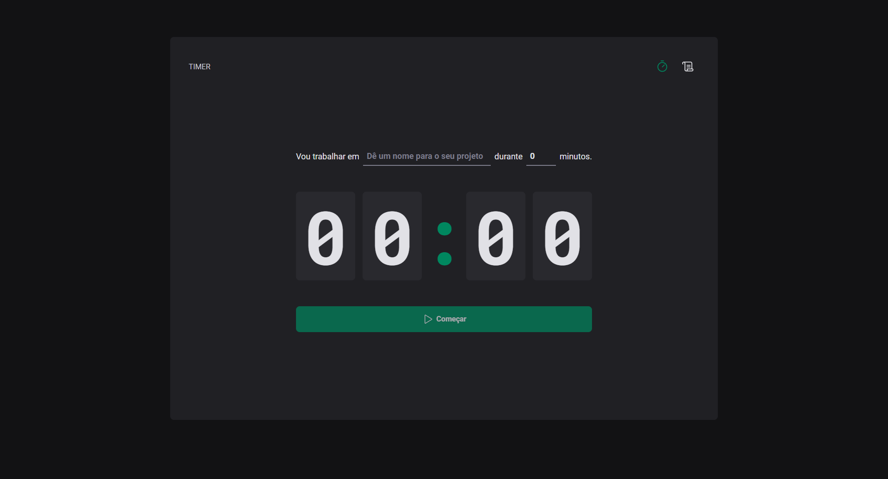

 ## 💻  Tweet Lite

### 🔥 Introdução

O timer é baseado na técnica pomodoro, onde você pode criar um novo projeto e definir um tempo para a sua conclusão. Com ele, você pode acompanhar o ciclo de evolução do projeto, seja se ele está interrompido, em andamento ou finalizado..





 ## :rocket: Tecnologias

Esse projeto foi desenvolvido com as seguintes tecnologias:

✔️TypeScript

✔️React-vite

✔️Styled-components

✔️Phosphor Icons

✔️Date-Fns

✔️Immer

✔️ react-hook-form

✔️ zod

✔️ react-router-dom


## ⚙ Configuração

```
- $ git clone https://github.com/diegofchagas/timer.git

- Para instalar as dependências:
> npm i

- Vá para a pasta do projeto

- Para iniciar a aplicação:
> npm run dev
```

### 🆙 Atualizações futuras

- Salvar histórico de projetos criados no localStorage.

## Desenvolvedor 
<span style="font-size: larger;">**Diego Chagas**</span>
